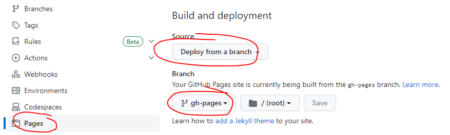

# Getting Started

## Prerequisites

This project has quite a complicated build chain to prepare the frontend code for the ESP32. You will need to install some tools to make this all work, starting with a powerful code editor.

### Softwares to Install

Please install the following software, if you haven't already:

- [VSCode](https://code.visualstudio.com/) - IDE for development
- [Node.js](https://nodejs.org) - For building the interface with npm

### VSCode Plugins and Setups

Please install the following mandatory VSCode Plugins:

- [PlatformIO](https://platformio.org/) - Embedded development platform
- [Prettier](https://prettier.io/) - Automated code formatter
- Svelte for VS Code - Makes working with Svelte much easier
- Svelte Intellisense - Another Svelte tool
- Tailwind CSS Intellisense - Makes working with Tailwind CSS much easier
- [Prettier plugin for Tailwind CSS](https://github.com/tailwindlabs/prettier-plugin-tailwindcss) - Automatically sorts the Tailwind classes into their recommended order

Lastly, if you want to make use of Materials for MkDocs as your documentation engine, install [Material for MkDocs](https://squidfunk.github.io/mkdocs-material/) by typing the following into the VSCode terminal:

```bash
pip install mkdocs-material
```

!!! tip

    You might need to run this as administrator, if you getting an error message.

### Project Structure

| Resource                                                                               | Description                                                      |
| -------------------------------------------------------------------------------------- | ---------------------------------------------------------------- |
| [.github/](https://github.com/theelims/ESP32-sveltekit/blob/main/.github)              | Github CI pipeline to deploy MkDocs to gh-pages                  |
| [docs/](https://github.com/theelims/ESP32-sveltekit/blob/main/docs)                    | MkDocs documentation files                                       |
| [interface/](https://github.com/theelims/ESP32-sveltekit/blob/main/interface)          | SvelteKit based front end                                        |
| [lib/framework/](https://github.com/theelims/ESP32-sveltekit/blob/main/lib/framework)  | C++ back end for the ESP32 device                                |
| [src/](https://github.com/theelims/ESP32-sveltekit/blob/main/src)                      | The main.cpp and demo project to get you started                 |
| [scripts/](https://github.com/theelims/ESP32-sveltekit/tree/main/scripts)              | Scripts that build the interface as part of the platformio build |
| [platformio.ini](https://github.com/theelims/ESP32-sveltekit/blob/main/platformio.ini) | PlatformIO project configuration file                            |
| [mkdocs.yaml](https://github.com/theelims/ESP32-sveltekit/blob/main/mkdocs.yaml)       | MkDocs project configuration file                                |

## Setting up PlatformIO

### Setup Build Target

!!! danger "Do not use the PlatformIO UI for editing platformio.ini"

    It is tempting to use the PlatformIO user interface to add dependencies or parameters to platformio.ini. However, doing so will remove all "irrelevant" information like comments from the file. Please edit the file directly in the editor.

[platformio.ini](https://github.com/theelims/ESP32-sveltekit/blob/main/platformio.ini) is the central file controlling the whole build process. It comes pre-configure with a few boards which have different ESP32 chips. It needs to be adapted to the board you want to program.

```ini
[platformio]
...
default_envs = esp32-s3-devkitc-1
...

[env:adafruit_feather_esp32_v2]
board = adafruit_feather_esp32_v2
board_build.mcu = esp32

[env:lolin_c3_mini]
board = lolin_c3_mini
board_build.mcu = esp32c3

[env:esp32-s3-devkitc-1]
board = esp32-s3-devkitc-1
board_build.mcu = esp32s3
```

If your board is not listed in the platformio.ini you may look in the [official board list](https://docs.platformio.org/en/latest/boards/index.html#espressif-32) for supported boards and add their information accordingly. Either delete the obsolete `[env:...]` sections, or change your board as `default_envs = ...`.

!!! info "Default setup is for an ESP32-S3-DevKitC/M board"

    The projects platformio.ini defaults for an ESP32-S3-DevKitC/M board by Espressif connected to the UART USB port. If you use an other board and the projects shows an undesired behavior it is likely that some parts do not match with pin definitions.

### Build & Upload Process

After you've changed [platformio.ini](https://github.com/theelims/ESP32-sveltekit/blob/main/platformio.ini) to suit your board you can upload the sample code to your board. This will download all ESP32 libraries and execute `node install` to install all node packages as well. Select your board's environment under the PlatformIO tab and hit `Upload and Monitor`.


The first build process will take a while. After a couple of minutes you can see the ESP32 outputting information on the terminal. Some of the python scripts might need to install additional packages. In that case the first build process will fail. Just run it a second time.

!!! tip "Use several terminals in parallel"

    VSCode allows you to have more then one terminal running at the same time. You can dedicate one terminal to the serial monitor, while having the development server running in an other terminal.

## Setting up SvelteKit

### Setup Proxy for Development

To ease the frontend development you can deploy the back end code on an ESP32 board and pass the websocket and REST API calls through the development server's proxy.
The [vite.config.ts](https://github.com/theelims/ESP32-sveltekit/blob/main/interface/vite.config.ts) file defines the location of the services which the development server will proxy. This is defined by the "target" property, which will need to be changed to the the IP address or hostname of the device running the firmware. Change this for both, "http://" and "ws://".

```ts
proxy: {
    // Proxying REST: http://localhost:5173/rest/bar -> http://192.168.1.83/rest/bar
    '/rest': {
    target: 'http://192.168.1.83',
    changeOrigin: true,
    },
    // Proxying websockets ws://localhost:5173/ws -> ws://192.168.1.83/ws
    '/ws': {
    target: 'ws://192.168.1.83',
    changeOrigin: true,
    ws: true,
    },
},
```

!!! tip

    You must restart the development server for changes of the proxy location to come into effect.

### Development Server

The interface comes with Vite as a development server. It allows hot module reloading reflecting code changes to the front end instantly in your browser. Open a new terminal session and execute the following commands:

```bash
cd interface
npm run dev
```

Follow the link to access the front end in your browser.

## Setup Material for mkdocs

Material for MkDocs allows you to create great technical documentation pages just from markup. If you don't want to use it just delete the `.github` and `docs` folder, as well as `mkdocs.yaml`.

Otherwise initiate the github CI pipeline by committing and pushing to your repository once. This triggers the automatic build. After a few minutes a new branch `gh-pages` containing the static website with your documentation should appear. To deploy it go to your github repository go under settings and complete the following steps.


### Development Server

MkDocs comes with a build-in development server which supports hot reload as well. Open a new terminal session in VSCode and type

```
mkdocs serve
```
